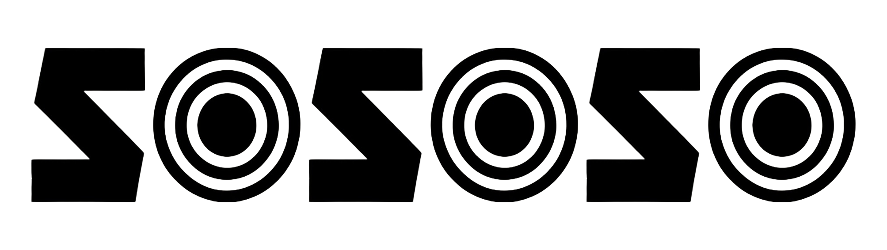

<p align="center">
  <picture>
    <source media="(prefers-color-scheme: dark)" srcset="public/sososo_brand_logo_white.png" />
    
  </picture>
</p>

<p align="center">
  <b>Real-time meeting &amp; audio transcription for Windows, macOS &amp; Linux</b><br />
  Live captions from your system audio <b>and</b> microphone, with AI summaries.
</p>

<p align="center">
  <a href="https://yusupsupriyadi.github.io/sososo/"><b>Website</b></a> ·
  <a href="https://github.com/yusupsupriyadi/sososo/releases/latest"><b>Download</b></a> ·
  <a href="https://youtu.be/al1_YU_ILXs"><b>Demo video</b></a>
</p>

<p align="center">
  <a href="./LICENSING.md"></a>
  <a href="https://github.com/yusupsupriyadi/sososo/actions/workflows/ci.yml"></a>
  <a href="https://tauri.app"></a>
  <a href="https://deepgram.com"></a>
  <a href="https://openai.com"></a>
  <a href="https://ai.google.dev"></a>
</p>

`sososo` captures what you hear (system audio) and what you say (microphone),
streams both to [Deepgram](https://deepgram.com) for live speech-to-text, and
shows captions in a translucent "liquid glass" window. When a session ends it
can generate an AI summary via [OpenAI](https://openai.com) or
[Google Gemini](https://ai.google.dev) — whichever you select in Settings.

It is a **bring-your-own-key** app: you bring your own Deepgram key plus an
AI-provider key (OpenAI **or** Google Gemini), stored securely in the OS
keychain (Windows Credential Manager / macOS Keychain / the Linux Secret
Service). There is no backend, no account, and no telemetry.

> [!IMPORTANT]
> **Platforms:** Windows 10/11, macOS 11+, and Linux (PulseAudio or PipeWire).
> System audio capture differs per OS: Windows uses WASAPI loopback (no setup);
> Linux captures your default output's **monitor** source automatically (no
> setup); macOS has no built-in loopback, so you route system audio through a
> free virtual device like [BlackHole](https://github.com/ExistentialAudio/BlackHole)
> — see [macOS system audio setup](#macos-system-audio-setup).

## Download

**Get the latest version for your OS — free, no account or sign-up needed:**

| OS                   | Download                                                                                                                                                                                                                                                                                                              |
| -------------------- | --------------------------------------------------------------------------------------------------------------------------------------------------------------------------------------------------------------------------------------------------------------------------------------------------------------------- |
| 🪟 **Windows 10/11** | **[Installer (.exe)](https://github.com/yusupsupriyadi/sososo/releases/latest/download/sososo_windows_x64-setup.exe)** · [.msi](https://github.com/yusupsupriyadi/sososo/releases/latest/download/sososo_windows_x64.msi)                                                                                             |
| 🍎 **macOS 11+**     | **[Universal .dmg](https://github.com/yusupsupriyadi/sososo/releases/latest/download/sososo_macos_universal.dmg)**                                                                                                                                                                                                    |
| 🐧 **Linux**         | **[.deb](https://github.com/yusupsupriyadi/sososo/releases/latest/download/sososo_linux_amd64.deb)** · [.AppImage](https://github.com/yusupsupriyadi/sososo/releases/latest/download/sososo_linux_amd64.AppImage) · [.rpm](https://github.com/yusupsupriyadi/sososo/releases/latest/download/sososo_linux_x86_64.rpm) |

These links always grab the [latest release](https://github.com/yusupsupriyadi/sososo/releases/latest) — or browse every version on the [Releases page](https://github.com/yusupsupriyadi/sososo/releases).

> [!NOTE]
> Builds aren't code-signed yet, so your OS may warn on first run — Windows:
> "More info" → "Run anyway"; macOS: right-click the app → **Open**. After
> installing, add your free [Deepgram API key](https://console.deepgram.com/signup)
> in **Settings** to start transcribing.

## Demo

<p align="center">
  <a href="https://youtu.be/al1_YU_ILXs">
    
  </a>
  <br />
  <a href="https://youtu.be/al1_YU_ILXs"><b>▶ Watch the demo on YouTube</b></a>
</p>

## Features

- 🎙️ **Dual capture** — system audio (loopback) + microphone, mixed into two
  diarized channels ("you" vs. "remote").
- ⚡ **Live captions** — interim + finalized transcript segments streamed in
  real time.
- 🌐 **Many languages** — Deepgram Nova-3 (multilingual / English) and Nova-2
  (other languages), with diarization and smart formatting.
- 🪟 **Compact recording widget** — a small always-on-top pill (pause / finish)
  while recording; full library, history, and settings views when idle.
- 🧠 **AI summaries & live translation** — optional end-of-session summary and
  per-line translation, powered by OpenAI **or** Google Gemini (your pick in
  Settings).
- 🔒 **Private by design** — keys in the OS keychain; no server, no telemetry.
  (See [PRIVACY.md](./PRIVACY.md) for what leaves your machine.)

## Privacy at a glance

This app sends audio and text to third-party services **you** configure:

- **Audio → Deepgram** over a secure WebSocket for transcription.
- **Transcript → your AI provider** (OpenAI or Google Gemini) — only when you
  trigger a summary or live translation.

Your API keys never leave your machine except as auth headers to those
services, and are stored in the OS keychain (Windows Credential Manager / macOS
Keychain / Linux Secret Service) — never in the repo or in plaintext config.
Full details in [PRIVACY.md](./PRIVACY.md).

## Install

Prebuilt downloads for every OS are in [**Download**](#download) above — that's
all most people need. To build it yourself:

### Build from source

**Prerequisites**

- [Bun](https://bun.sh) (package manager — do not use npm/yarn/pnpm)
- [Rust](https://rustup.rs) (stable toolchain)
- **Windows 10/11** with [WebView2](https://developer.microsoft.com/microsoft-edge/webview2/)
  (preinstalled on current Windows), **macOS 11+** with Xcode Command Line Tools
  (`xcode-select --install`), or **Linux** with PulseAudio/PipeWire and the
  WebKitGTK + libpulse dev libraries
- **Linux only** — install the build dependencies (Debian/Ubuntu):
  ```sh
  sudo apt-get install -y libwebkit2gtk-4.1-dev libgtk-3-dev libayatana-appindicator3-dev librsvg2-dev patchelf libpulse-dev
  ```

```sh
bun install
bun run tauri dev     # run the desktop app in development
bun run tauri build   # produce an installer in src-tauri/target/release/bundle
```

## Configure your API keys

1. Launch the app and open **Settings**.
2. Paste your **Deepgram** API key (required for transcription). For AI features,
   pick your **Active AI provider** (OpenAI or Google Gemini) and paste that
   provider's API key (optional — only needed for summaries and live
   translation).
3. Keys are saved to the OS keychain (Windows Credential Manager / macOS
   Keychain / Linux Secret Service). The app only ever checks _whether_ a key
   exists — it never reads keys back into the UI.

Get keys from the [Deepgram console](https://console.deepgram.com), the
[OpenAI dashboard](https://platform.openai.com/api-keys), or
[Google AI Studio](https://aistudio.google.com/app/apikey).

## macOS system audio setup

macOS has no built-in way to capture system audio, so route your output through
a free virtual audio device:

1. Install [BlackHole](https://github.com/ExistentialAudio/BlackHole)
   (`brew install blackhole-2ch`), or any equivalent loopback device.
2. Open **Audio MIDI Setup** and create a **Multi-Output Device** that includes
   both your speakers/headphones **and** "BlackHole 2ch"; set it as the system
   output so you still hear audio while it is also routed to BlackHole.
3. In sososo, open **Settings → Audio Devices**, pick your microphone, and
   choose **BlackHole 2ch** as the _system audio source_.
4. On the first recording, macOS prompts for **microphone** access — allow it.

> [!NOTE]
> On Windows none of this is needed — WASAPI loopback captures the chosen output
> device directly. On Linux it's automatic too — sososo records your default
> output's **monitor** source (PulseAudio/PipeWire); pick a specific output in
> **Settings → Audio Devices** to capture a different one.

## Development

The package manager is **Bun**.

| Task                        | Command                                                  |
| --------------------------- | -------------------------------------------------------- |
| Run the desktop app (dev)   | `bun run tauri dev`                                      |
| Frontend only (browser)     | `bun run dev` → http://localhost:1420                    |
| Typecheck + build frontend  | `bun run build`                                          |
| Format (Prettier + rustfmt) | `bun run format` · `bun run fmt:rust`                    |
| Format check                | `bun run format:check` · `bun run fmt:rust:check`        |
| Rust check / lint           | `cargo check` · `cargo clippy` (in `src-tauri/`)         |
| Audio capture smoke test    | `cargo run --example audio_probe -- 6` (in `src-tauri/`) |

Formatting is enforced by a Husky pre-commit hook (lint-staged runs Prettier on
web files and rustfmt on Rust). See [CONTRIBUTING.md](./CONTRIBUTING.md).

## Tech stack

- **Backend:** Tauri 2 (Rust) — audio capture (WASAPI on Windows, CoreAudio via
  cpal on macOS, PulseAudio/PipeWire via libpulse on Linux), Deepgram WS
  streaming, SQLite persistence, AI summaries & translation via OpenAI or Google
  Gemini.
- **Frontend:** React 19 · React Router 7 · Zustand 5 · Vite 7 · Tailwind CSS v4
  (TypeScript).

Architecture notes and per-feature history live in
[`.development-history/`](./.development-history) and `CLAUDE.md`.

## Contributing

Contributions are welcome — please read [CONTRIBUTING.md](./CONTRIBUTING.md) and
our [Code of Conduct](./CODE_OF_CONDUCT.md). To report a security issue, see
[SECURITY.md](./SECURITY.md).

## Powered by

sososo stands on the shoulders of best-in-class speech and AI APIs:

- 🟢 **[Deepgram](https://deepgram.com)** — real-time speech-to-text (Nova-3 /
  Nova-2) with diarization and smart formatting. It is the engine behind every
  live caption in the app. Start with the
  [console](https://console.deepgram.com) and the
  [developer docs](https://developers.deepgram.com).
- 🧠 **[OpenAI](https://openai.com)** or **[Google Gemini](https://ai.google.dev)**
  — optional, user-selectable AI summaries and live translation. Bring a key
  from the [OpenAI dashboard](https://platform.openai.com/api-keys) or
  [Google AI Studio](https://aistudio.google.com/app/apikey).

Huge thanks to the [Deepgram](https://deepgram.com) team — sososo simply would
not exist without their speech API. 💚

## License

`sososo` is **dual-licensed**:

- **Community edition** — [GNU AGPL-3.0](./LICENSE) (free; if you distribute or
  host a modified version, you must release your source under the AGPL too).
- **Commercial license** — for closed-source/proprietary use without the AGPL's
  copyleft. See [LICENSING.md](./LICENSING.md) and
  [COMMERCIAL-LICENSE.md](./COMMERCIAL-LICENSE.md), or email
  <yusupsupriyadi.cv@gmail.com>.

The **"sososo" name and logo are trademarks** and are not covered by the code
license — forks must rebrand (see [TRADEMARK.md](./TRADEMARK.md)). Contributions
are accepted under the [CLA](./CLA.md).

© 2026 Yusup Supriyadi.
