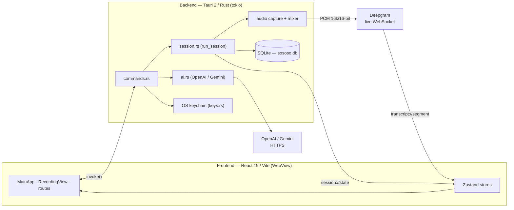

# sososo — Documentation

Developer & architecture documentation for **sososo**, a desktop app for
real-time meeting/audio transcription. It captures system audio + microphone,
streams both to [Deepgram](https://deepgram.com) for live speech-to-text, shows
captions in a translucent "liquid glass" window, and can generate AI summaries
and live translations via OpenAI or Google Gemini.

This folder is the **technical reference** for contributors. For the product
pitch, install steps, and feature list, see the top-level
[`README.md`](../README.md).

> **Platforms:** Windows 10/11 and macOS 11+. Linux is not supported.
> **Version:** 0.2.0 · **Stack:** Tauri 2 (Rust) + React 19 / Vite 7 (TypeScript).

## Start here

| If you want to…                                | Read                                                 |
| ---------------------------------------------- | ---------------------------------------------------- |
| Understand how the whole thing fits together   | [Architecture](./architecture.md)                    |
| Follow the audio → speech-to-text data flow    | [Audio pipeline](./audio-pipeline.md)                |
| Call the backend from the UI (commands/events) | [IPC reference](./ipc-reference.md)                  |
| Know the data shapes & database schema         | [Data model](./data-model.md)                        |
| Work on the React UI, state, or styling        | [Frontend](./frontend.md)                            |
| Touch AI summaries or live translation         | [AI & translation](./ai-and-translation.md)          |
| Handle API keys, permissions, or config        | [Security & configuration](./security-and-config.md) |
| Set up the repo and run/verify locally         | [Development](./development.md)                      |
| Build installers or cut a release              | [Build & release](./build-and-release.md)            |
| Learn the Windows vs macOS differences         | [Platform support](./platform-support.md)            |

## The 60-second mental model

- A **single window** renders everything. While a session is active it becomes a
  compact, always-on-top recording widget; otherwise it shows the
  library/settings/history shell.
- The **frontend** calls Rust **commands** via Tauri `invoke()` and listens for
  two **global events** (`session://state`, `transcript://segment`).
- The **backend** captures audio on dedicated OS threads, mixes mic + system into
  a 2-channel stream, and streams it to Deepgram over a WebSocket. Final
  transcript lines are persisted to **SQLite**.
- **API keys** live in the **OS keychain** and never reach the frontend.
- **AI summary** and **live translation** call OpenAI or Gemini directly from
  Rust (`reqwest`), using the key from the keychain.

## See also

- [`CLAUDE.md`](../CLAUDE.md) — repo-level guidance and conventions.
- [`CONTRIBUTING.md`](../CONTRIBUTING.md) — contribution workflow.
- [`PRIVACY.md`](../PRIVACY.md) / [`SECURITY.md`](../SECURITY.md) — what leaves
  your machine, and how to report issues.
- [`.development-history/`](../.development-history) — terse per-feature change
  reports (the project's running knowledge base).
