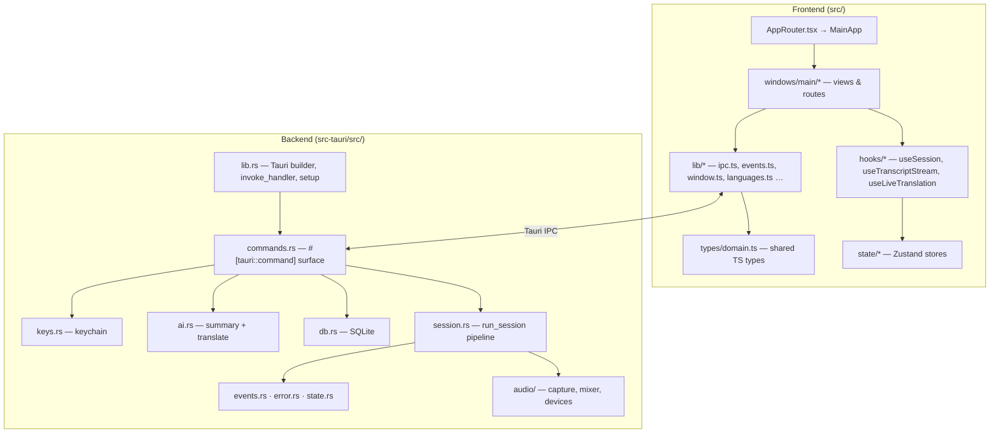
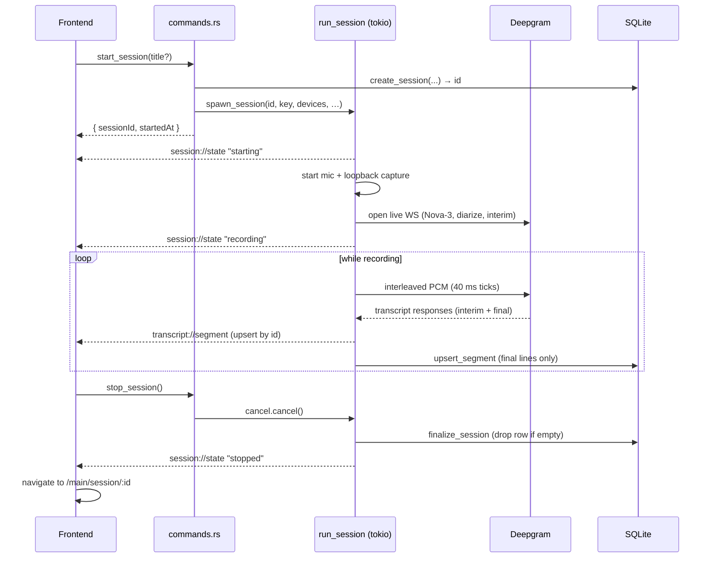

# Architecture

A high-level tour of how sososo is put together: the process model, the
single-window UI, the layers, and the runtime lifecycle of a session.

For the data flow that actually produces captions, see the
[Audio pipeline](./audio-pipeline.md). For the exact command/event contract, see
the [IPC reference](./ipc-reference.md).

## What it is

sososo is a **Tauri 2** desktop app. The backend is **Rust**; the frontend is a
**React 19 + Vite 7** single-page app rendered in the OS WebView. There is no
server, no account, and no telemetry — it is a local, bring-your-own-key app.

| Layer          | Technology                                                                    |
| -------------- | ----------------------------------------------------------------------------- |
| Shell          | Tauri 2 (`macos-private-api` feature), single window                          |
| Backend        | Rust, async on the Tokio multi-thread runtime                                 |
| Audio          | WASAPI (`wasapi`, Windows) · CoreAudio (`cpal`, macOS)                        |
| Speech-to-text | Deepgram live streaming WebSocket (`deepgram` crate)                          |
| Persistence    | SQLite via `rusqlite` (bundled), WAL mode                                     |
| AI             | OpenAI Chat Completions / Google Gemini `generateContent` (`reqwest`, rustls) |
| Secrets        | OS keychain via `keyring` (Credential Manager / macOS Keychain)               |
| Frontend       | React 19, React Router 7 (`HashRouter`), Zustand 5, Tailwind CSS v4           |
| Tooling        | Bun (package manager), Vite, TypeScript (strict)                              |

## Single window, state-driven views

The app declares exactly **one window** (`main`) in
[`tauri.conf.json`](../src-tauri/tauri.conf.json). A single Vite build serves it
via `index.html#/main`. There is no separate overlay window.

[`MainApp`](../src/windows/main/MainApp.tsx) is **session-state-driven**:

- While a session is **active** (`starting` / `recording` / `stopping` /
  `reconnecting`) it renders [`RecordingView`](../src/windows/main/RecordingView.tsx)
  — a compact, always-on-top floating widget (a pill with pause/finish/translate
  buttons above the live transcript). On mount it shrinks the window
  (`enterRecordingWindow`, 460×600); on unmount it restores it (1040×720).
- Otherwise it renders the **normal shell**: titlebar + session sidebar +
  routed content (library, settings, session detail, about).

When a session ends, `MainApp` navigates to the session detail (where the AI
summary lives) if anything was transcribed, else back home.

The window is `transparent: true` with `decorations: false` (Windows) — the
desktop shows through sharply. The translucent tint comes entirely from CSS
panel backgrounds (the "liquid glass" look), not native acrylic/vibrancy. See
[Frontend → Styling](./frontend.md#styling-liquid-glass) and
[Platform support](./platform-support.md#window-chrome) for the macOS variant.

## Layered structure

### Backend modules (`src-tauri/src/`)

| File          | Responsibility                                                                               |
| ------------- | -------------------------------------------------------------------------------------------- |
| `lib.rs`      | Tauri builder, registers all commands in `invoke_handler!`, opens the DB in `setup()`.       |
| `main.rs`     | Thin binary entry that calls `sososo_lib::run()`.                                            |
| `commands.rs` | Every `#[tauri::command]` — the entire IPC surface. See [IPC reference](./ipc-reference.md). |
| `session.rs`  | `spawn_session` / `run_session` — the async capture→STT→events pipeline.                     |
| `audio/`      | `capture/` (per-OS), `mixer.rs` (`Interleaver`), `devices/` (per-OS enumeration).            |
| `db.rs`       | SQLite connection, schema, migrations, and all queries.                                      |
| `ai.rs`       | OpenAI/Gemini transports, prompts, summary + translation.                                    |
| `keys.rs`     | API-key storage in the OS keychain.                                                          |
| `events.rs`   | Event name constants + the `SessionState` / `TranscriptSegment` payloads.                    |
| `state.rs`    | `AppState` (Tauri-managed, Mutex-guarded runtime state).                                     |
| `error.rs`    | `AppError` enum (serializes to a plain string for the UI).                                   |

### Frontend modules (`src/`)

| Path              | Responsibility                                                                                                               |
| ----------------- | ---------------------------------------------------------------------------------------------------------------------------- |
| `AppRouter.tsx`   | `HashRouter`; routes everything to `MainApp`.                                                                                |
| `windows/main/`   | `MainApp`, `RecordingView`, `Titlebar`, `SessionSidebar`, and `routes/`.                                                     |
| `hooks/`          | `useSession`, `useTranscriptStream`, `useLiveTranslation`, `useElapsedTimer`.                                                |
| `state/`          | Zustand stores: `sessionStore`, `transcriptStore`, `configStore`, `libraryStore`.                                            |
| `lib/`            | `ipc.ts` (command wrappers), `events.ts`, `window.ts`, `languages.ts`, `speaker.ts`, `platform.ts`, `format.ts`, `icons.ts`. |
| `types/domain.ts` | Shared TypeScript types mirroring the Rust payloads.                                                                         |
| `styles/app.css`  | Tailwind v4 import, `@theme` tokens, the `liquid-glass` utility.                                                             |

## Process & threading model

- The **Tauri main process** runs the WebView and the Tokio runtime.
- `start_session` validates state, creates the DB row synchronously, then
  `spawn_session` launches `run_session` on the Tokio runtime.
- **Audio capture** runs on **dedicated OS threads**, one per source:
  - Windows: each thread joins an **MTA COM apartment** (`initialize_mta()`),
    required by WASAPI. Command worker threads may be STA, so any WASAPI work
    (including device enumeration in `list_devices`) is moved to a fresh thread.
  - macOS: cpal builds the stream on the capture thread; the data callback runs
    on CoreAudio's own realtime thread.
- A **Tokio bridge task** ticks every 40 ms, drains the capture channels, and
  forwards interleaved bytes into the Deepgram stream.
- Realtime threads hand audio to async code over **bounded crossbeam channels**
  that **drop on lag** — fresh audio is preferred over low latency growth.
- Stop is cooperative via a `tokio_util::CancellationToken`.

State shared across these is in [`AppState`](../src-tauri/src/state.rs)
(`Mutex`-guarded): the active session (id + cancel token + paused flag), the
selected device ids, the language, and the `system_only` flag. The SQLite
[`Db`](../src-tauri/src/db.rs) is a separate Tauri-managed handle.

## Runtime lifecycle of a session

Pause/resume (`set_paused`) flips an `AtomicBool`: while paused the bridge
discards captured audio and forwards nothing, but the Deepgram WS stays open via
the SDK keep-alive, so transcription halts and resumes without reconnecting.

## Where to go next

- [Audio pipeline](./audio-pipeline.md) — the five stages in detail.
- [IPC reference](./ipc-reference.md) — every command and event.
- [Data model](./data-model.md) — types and the SQLite schema.
