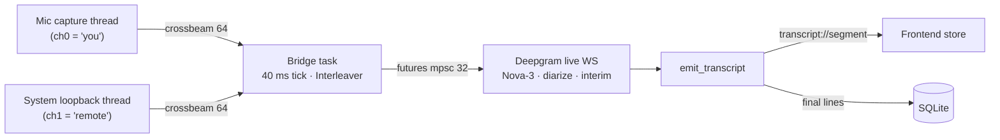

# Audio pipeline

The core data flow: from two OS audio sources to live captions in the UI. This
is implemented in [`session.rs`](../src-tauri/src/session.rs) (`run_session`)
plus the [`audio/`](../src-tauri/src/audio) module.

## The PCM contract

Every capture source produces the **same shape** so the mixer and Deepgram
stream can stay simple:

> **16 kHz · 16-bit signed · mono · little-endian `i16`**
> (`TARGET_SAMPLE_RATE = 16_000`, `TARGET_CHANNELS = 1` in
> [`audio/mod.rs`](../src-tauri/src/audio/mod.rs))

- **Windows** gets this for free: WASAPI's `autoconvert` resamples/downmixes from
  the device's native format to exactly this target.
- **macOS** does it in software: cpal delivers the device's native format, so the
  backend downmixes to mono and resamples to 16 kHz itself.
- **Linux** gets it from the server: libpulse requests this exact spec and
  PulseAudio/PipeWire converts (resample + downmix) before delivery — no
  client-side resampling.

## The five stages



### 1) Capture — `audio/capture/`

Mic and system-loopback each run on their **own thread**, delivering `Vec<i16>`
chunks over a **bounded crossbeam channel (capacity 64)**. The channel uses
`try_send` and **drops on lag**, favoring fresh audio over unbounded latency.

```rust
pub fn start_loopback_capture(device_id: Option<String>) -> AppResult<CaptureHandle>
pub fn start_mic_capture(device_id: Option<String>) -> AppResult<CaptureHandle>
```

A `CaptureHandle` exposes `rx` (the receiver) and a `stop()` that signals the
thread and joins it (also done on `Drop`). The backend is selected at compile
time:

- **Windows** ([`capture/windows.rs`](../src-tauri/src/audio/capture/windows.rs)):
  WASAPI. The thread calls `initialize_mta()` (COM), then opens the device in
  **polling shared mode** with `autoconvert: true`. Loopback captures a _render_
  (output) device in capture mode; the mic captures an _input_ device. **Polling
  is mandatory** — the loopback stream flag is incompatible with event callbacks,
  so the mic uses polling too for a single code path. The loop reads available
  frames every ~8 ms and `try_send`s them.
- **macOS** ([`capture/macos.rs`](../src-tauri/src/audio/capture/macos.rs)):
  CoreAudio via cpal. There is **no per-output loopback** on macOS, so both the
  mic and "system audio" are ordinary _input_ devices — the latter is expected to
  be a virtual device like [BlackHole](https://github.com/ExistentialAudio/BlackHole)
  that the user routes their output into. The data callback downmixes to mono
  (`downmix_to_mono`) and resamples to 16 kHz with a small stateful
  `LinearResampler`, then `try_send`s `Vec<i16>`.
- **Linux** ([`capture/linux.rs`](../src-tauri/src/audio/capture/linux.rs)):
  PulseAudio/PipeWire via libpulse-simple. The mic records a PA _source_; "system
  audio" records a sink **monitor** source (the default sink's monitor when none is
  chosen) — every output sink has one, so no virtual device is needed. The record
  stream is opened with the 16 kHz/16-bit/mono spec, so PA converts server-side and
  the blocking-read loop just forwards `Vec<i16>` (no resampler). Source/monitor
  enumeration uses one-shot introspection in
  [`pulse.rs`](../src-tauri/src/audio/pulse.rs).

### 2) Mix — `audio/mixer.rs` (`Interleaver`)

The two capture endpoints (WASAPI / CoreAudio / libpulse) run on **independent
clocks** and drift over
long sessions. The `Interleaver` interleaves mic (channel 0) and system
(channel 1) into one 2-channel stream `[mic0, sys0, mic1, sys1, …]`, emitting
only `min(mic, sys)` paired frames. If one side races ahead beyond `max_skew`
(set to `TARGET_SAMPLE_RATE / 5` ≈ **200 ms**), the starved side is **padded with
silence** so the paired output stays time-aligned instead of drifting forever.

In `system_only` mode the mixer is skipped — the system stream is forwarded as
**mono** (one channel).

### 3) Bridge — the 40 ms tick

A Tokio task drains the crossbeam receivers and forwards bytes into a
`futures::channel::mpsc` stream (capacity 32) consumed by the Deepgram SDK:

- Runs `tokio::time::interval(40 ms)`.
- **Recording:** push drained mic/system chunks into the `Interleaver`, then
  `drain_interleaved_bytes()` (or mono bytes for `system_only`).
- **Paused:** drain and **discard** captured audio (keeps the bounded channels
  fresh) and forward **nothing** — the Deepgram keep-alive holds the WS open.
- Stops when the `CancellationToken` is cancelled or the receiver closes.

### 4) Stream — Deepgram live WebSocket

The stream is opened in `run_session` with these options:

| Option            | Value                                 | Notes                                  |
| ----------------- | ------------------------------------- | -------------------------------------- |
| `model`           | **`Nova-3`** for every language       | See the note below.                    |
| `language`        | `multi` / `en` / `id` / `Other(code)` | `multi` = multilingual auto-detect.    |
| `multichannel`    | `true` when 2 channels (mic + system) | `false` in `system_only` (mono).       |
| `diarize`         | `true`                                | Speaker labels per word.               |
| `smart_format`    | `true`                                | Numbers, punctuation, formatting.      |
| `punctuate`       | `true`                                |                                        |
| `interim_results` | `true`                                | Drives the live, replace-in-place UI.  |
| `endpointing`     | `CustomDurationMs(100)`               |                                        |
| `encoding`        | `Linear16`                            | Matches the 16-bit LE PCM.             |
| `sample_rate`     | `16000`                               |                                        |
| `channels`        | `1` or `2`                            | 2 for mic+system, 1 for `system_only`. |
| `keep_alive`      | enabled                               | Holds the WS open during pauses.       |

> **Model note (read the code, not the older docs):**
> [`model_language()`](../src-tauri/src/session.rs) currently maps **all**
> languages to `Model::Nova3`. Earlier docs/changelog mention "Nova-2 for other
> languages"; that is no longer what the code does — Nova-3 is used everywhere
> because of its broader coverage and accuracy (including Indonesian streaming).

### 5) Emit & persist — `emit_transcript`

Each `StreamResponse::TranscriptResponse` becomes a `TranscriptSegment`:

- **`source`** — `"remote"` when `system_only` or `channel_index == 1`,
  otherwise `"you"` (mic = channel 0).
- **`speaker`** — `"You"` for your own mic; for remote audio, `"Speaker N"` from
  Deepgram's 1-based diarization index (or `None` if undiarized).
- **`segmentId`** — `"{session_id}:{channel}:{start:.2}"`. Stable across interim
  updates of the same utterance, so the frontend **upserts by id** (interim text
  is replaced in place when finalized).
- Empty transcripts are dropped; `Metadata` / `SpeechStarted` / `UtteranceEnd` /
  `Terminal` responses are ignored.

The segment is emitted globally as **`transcript://segment`**. **Only finalized**
lines (`is_final == true`) are persisted (`db.upsert_segment`) — interim results
would churn/duplicate in storage.

## Stop & teardown

`stop_session` cancels the `CancellationToken`. `run_session` then stops both
captures, awaits the bridge, and calls `finalize_session`, which sets `ended_at`
**or deletes the session row if no segments were produced** (so failed or
instantly-stopped starts don't clutter history). A final `session://state`
`"stopped"` is emitted. Errors during setup go through `fail()`, which also drops
the empty row and emits `"error"`.

## Device enumeration — `audio/devices/`

`list_devices` (a command) returns input + output device lists for Settings:

- **Windows** ([`devices/windows.rs`](../src-tauri/src/audio/devices/windows.rs)):
  WASAPI capture endpoints (mics) and render endpoints (outputs to loopback). The
  device **id** is the stable WASAPI endpoint id; `is_default` flags the system
  default.
- **macOS** ([`devices/macos.rs`](../src-tauri/src/audio/devices/macos.rs)): cpal
  input devices only (there is no per-output loopback), surfaced for **both** the
  mic and the system-audio selector. cpal has no stable endpoint id, so the
  device **name is used as the id** (capture resolves devices by name).
- **Linux** ([`devices/linux.rs`](../src-tauri/src/audio/devices/linux.rs)):
  PulseAudio sources via libpulse introspection — non-monitor sources for the mic,
  and each sink's **monitor** source for system audio. The source/monitor **name is
  the id**; `is_default` flags the default source and the default sink's monitor.

`null`/`None` device ids mean "system default".

## Verification — `audio_probe`

There is no unit-test framework. The capture pipeline is verified with the
[`audio_probe`](../src-tauri/examples/audio_probe.rs) example:

```sh
cd src-tauri
cargo run --example audio_probe -- 6   # capture 6 seconds
```

It enumerates devices, captures mic + system for N seconds, interleaves them
(L = mic, R = system), prints per-channel RMS, and writes `audio_probe.wav`. Play
audio and speak while it runs to confirm **both** channels carry signal.

## Related

- [Architecture → Process & threading model](./architecture.md#process--threading-model)
- [IPC reference → `transcript://segment`](./ipc-reference.md#events)
- [Data model → segments](./data-model.md#segments)
- [Platform support](./platform-support.md) — Windows / macOS / Linux audio specifics.
