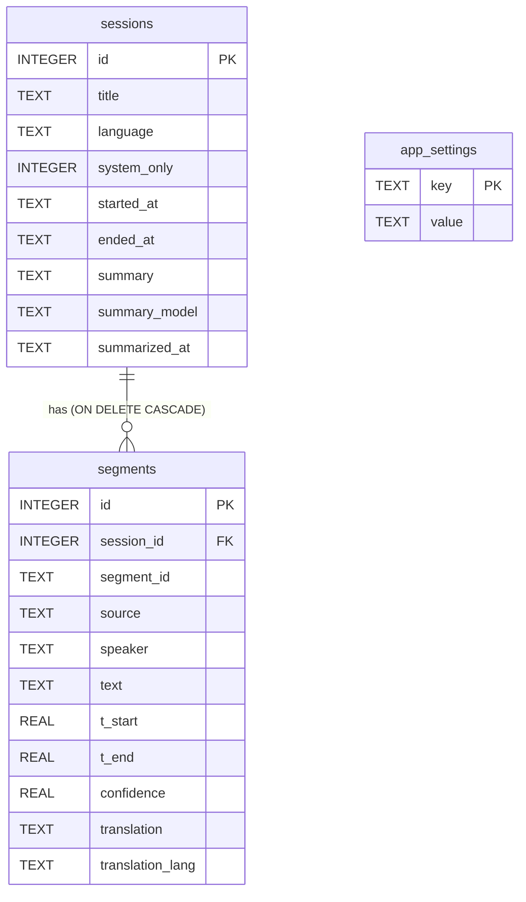
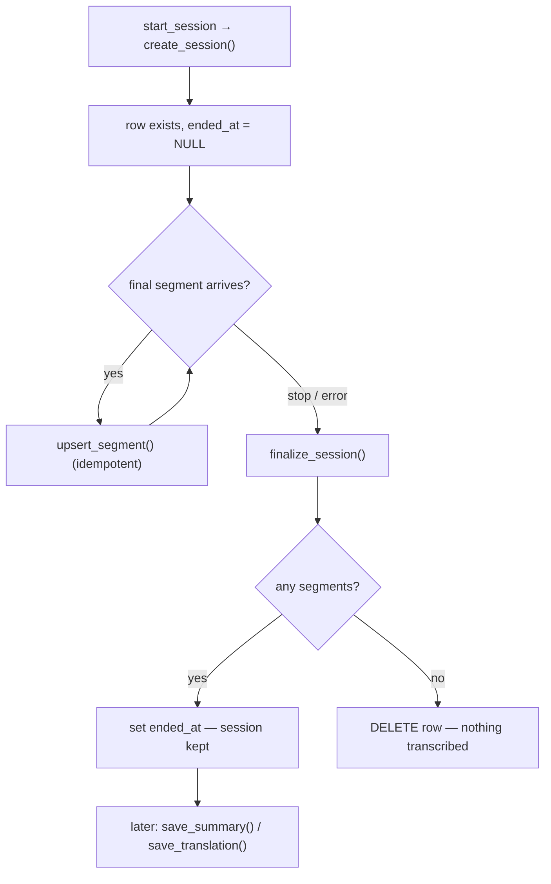

# Data model

The shared data shapes (TypeScript ↔ Rust) and the SQLite schema that backs
session history.

## Shared types

The frontend types in [`types/domain.ts`](../src/types/domain.ts) mirror the Rust
structs in [`commands.rs`](../src-tauri/src/commands.rs),
[`events.rs`](../src-tauri/src/events.rs), and [`db.rs`](../src-tauri/src/db.rs)
(Rust serializes camelCase via `#[serde(rename_all = "camelCase")]`).

| TypeScript (frontend)        | Rust (backend)               | Used for                         |
| ---------------------------- | ---------------------------- | -------------------------------- |
| `DeviceInfo`, `DeviceLists`  | `DeviceInfo`, `DeviceLists`  | `listDevices`                    |
| `SessionStateEvent`          | `SessionState`               | `session://state` event          |
| `TranscriptSegmentEvent`     | `TranscriptSegment`          | `transcript://segment` event     |
| `StartResult` / `StopResult` | `StartResult` / `StopResult` | `start_session` / `stop_session` |
| `SessionSummary`             | `SessionSummary`             | history list + detail header     |
| `StoredSegment`              | `StoredSegment`              | persisted transcript line        |
| `SessionDetail`              | `SessionDetail`              | `getSession`                     |
| `ApiService` / `AiProvider`  | (string args)                | key & provider selection         |

Key enums/aliases:

```ts
type Source = 'you' | 'remote';
type ApiService = 'deepgram' | 'openai' | 'gemini';
type AiProvider = 'openai' | 'gemini';
type SessionStateName =
  | 'idle'
  | 'starting'
  | 'recording'
  | 'stopping'
  | 'stopped'
  | 'reconnecting'
  | 'error';
```

> **Two segment shapes.** `TranscriptSegmentEvent` is the **live** wire shape
> (includes `isFinal`, `segmentId`, `sessionId`). `StoredSegment` is the
> **persisted/read-back** shape (drops `isFinal`/ids, adds `translation` +
> `translationLang`). The DB only ever stores finalized lines.

## SQLite database

A single long-lived `rusqlite::Connection`, `Mutex`-guarded, kept in
Tauri-managed state ([`Db`](../src-tauri/src/db.rs)). It is opened in `lib.rs`
`setup()` at `app_data_dir()/sososo.db` (created if missing).

- **Location:** the OS app-data dir for identifier `com.yusup.sososo`
  (e.g. `%APPDATA%\com.yusup.sososo\` on Windows,
  `~/Library/Application Support/com.yusup.sososo/` on macOS).
- **Pragmas:** `journal_mode = WAL`, `foreign_keys = ON`.
- Writes during a session are infrequent (one row per **final** segment), so the
  mutex is never held long. Network `await`s in commands never hold the lock.

### Schema



#### `sessions`

One row per recording. `started_at` / `ended_at` are RFC-3339 strings;
`system_only` is `0/1`. The `summary*` columns stay `NULL` until an AI summary is
generated (Milestone E).

#### `segments`

One row per **finalized** transcript line.

- `UNIQUE (session_id, segment_id)` makes `upsert_segment` idempotent — an interim
  line that finalizes updates the same row (`ON CONFLICT … DO UPDATE`).
- `source` is `"you"` / `"remote"`; `speaker` is `"You"` / `"Speaker N"` / `NULL`.
- `translation` + `translation_lang` are filled by live translation (or `NULL`).
- Index `idx_segments_session (session_id, t_start, id)` backs the chronological
  transcript reads.

#### `app_settings`

A simple key→value store for preferences that outlive a launch:

| Key                | Values                      | Default    | Command                    |
| ------------------ | --------------------------- | ---------- | -------------------------- |
| `summary_language` | a language code or `"auto"` | `"auto"`   | `get/set_summary_language` |
| `ai_provider`      | `"openai"` / `"gemini"`     | `"openai"` | `get/set_ai_provider`      |

## Persistence lifecycle



- `create_session(title, language, system_only, started_at) → id` runs
  synchronously inside `start_session` so the id can be returned immediately.
- `upsert_segment` persists only finalized lines.
- `finalize_session(id, ended_at)` keeps the row (sets `ended_at`) **only if it
  has segments**, otherwise deletes it — keeping history free of empty/failed
  starts. Returns whether the session was kept.
- `save_summary` / `save_translation` update existing rows after the fact.
- `rename_speaker` updates `speaker` across a session (`source` is untouched, so
  the mic/remote icon and the reserved "You" color are preserved).

## Migrations

Fresh databases get the full schema from `SCHEMA`. For pre-existing `sososo.db`
files, [`migrate()`](../src-tauri/src/db.rs) additively adds columns introduced
after the first release (SQLite lacks `ADD COLUMN IF NOT EXISTS`): `summary`,
`summary_model`, `summarized_at` on `sessions`, and `translation`,
`translation_lang` on `segments`. It inspects `PRAGMA table_info` and only adds
what is missing — safe to run on every open.

## Related

- [IPC reference](./ipc-reference.md) — the commands that read/write these rows.
- [AI & translation](./ai-and-translation.md) — how `summary*` and
  `translation*` get populated.
- [Audio pipeline → Emit & persist](./audio-pipeline.md#5-emit--persist--emit_transcript).
