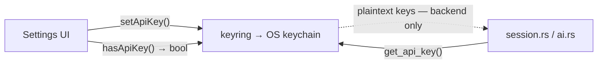

# Security & configuration

How secrets are stored, what permissions the window has, the content-security
policy, and where every piece of configuration lives.

## Secrets — the OS keychain

API keys are stored via the [`keyring`](https://crates.io/crates/keyring) crate
in the OS keychain ([`keys.rs`](../src-tauri/src/keys.rs)):

- **Windows** → Credential Manager (`windows-native` feature).
- **macOS** → Keychain (`apple-native` feature).
- Service name: **`com.yusup.sososo`**; one entry per provider — `deepgram`,
  `openai`, `gemini`.

**Keys are write-only from the UI.** `set_api_key(service, value)` stores a key;
`has_api_key(service)` returns only a **boolean**. There is no command that reads
a key back into the frontend — the backend reads keys directly from the keychain
when it needs them (opening the Deepgram stream, calling OpenAI/Gemini). Keys are
never written to the repo, to `app_settings`, or to plaintext config.



## Window capabilities

[`capabilities/main.json`](../src-tauri/capabilities/main.json) grants the `main`
window the **minimum** permissions it uses:

| Permission                                    | Why                                                         |
| --------------------------------------------- | ----------------------------------------------------------- |
| `core:default`                                | Tauri core defaults.                                        |
| `core:window:allow-start-dragging`            | Drag the frameless window / pill.                           |
| `core:window:allow-minimize`, `…allow-close`  | Titlebar buttons.                                           |
| `core:window:allow-set-size`, `…allow-center` | Shrink/restore + recenter for the recording widget.         |
| `core:window:allow-set-always-on-top`         | Float the recording widget.                                 |
| `opener:default`                              | Open external links (repo, consoles) in the system browser. |

These back the helpers in [`lib/window.ts`](../src/lib/window.ts)
(`enterRecordingWindow`/`exitRecordingWindow`/`minimizeSelf`/`closeSelf`/
`startDragging`).

## Content Security Policy

Set in [`tauri.conf.json`](../src-tauri/tauri.conf.json) → `app.security.csp`:

```
default-src 'self';
img-src 'self' asset: http://asset.localhost data:;
style-src 'self' 'unsafe-inline';
font-src 'self' data:;
connect-src 'self' ipc: http://ipc.localhost
```

> **Note:** `connect-src` does **not** include Deepgram/OpenAI/Gemini domains —
> and doesn't need to. All network calls (the Deepgram WebSocket, the OpenAI/Gemini
> HTTPS requests) happen in the **Rust backend** via `reqwest`/the Deepgram SDK,
> **not** from the WebView. The webview only talks to the backend over `ipc:`.

## Where configuration lives

Configuration is split across three tiers by lifetime and sensitivity:

| Tier               | Store                          | Contents                                                                           | Lifetime                |
| ------------------ | ------------------------------ | ---------------------------------------------------------------------------------- | ----------------------- |
| Secrets            | OS keychain                    | Deepgram / OpenAI / Gemini keys                                                    | Until removed in the OS |
| Persisted prefs    | SQLite `app_settings`          | `ai_provider`, `summary_language`                                                  | Across launches         |
| Persisted UI prefs | `localStorage` `sososo-config` | `uiScale`, `transcriptScale`, `glassOpacity`, `translateEnabled`, `targetLanguage` | Across launches         |
| Runtime state      | Rust `AppState` (in-memory)    | selected devices, `language`, `system_only`, active session                        | Current launch only     |

See [Data model → `app_settings`](./data-model.md#app_settings) and
[Frontend → configStore](./frontend.md#configstore-persisted) for the exact keys
and defaults.

> **Consequence:** device/language/`system_only` choices are **not** persisted —
> they are pushed to the backend `AppState` for the session and reset to defaults
> on restart. The AI provider, summary language, and appearance prefs **are**
> persisted.

## The Settings surface

[`SettingsRoute`](../src/windows/main/routes/SettingsRoute.tsx) is the single UI
for all of the above:

- **API keys** — Deepgram (required), OpenAI, Gemini; shows only whether each is
  set (`hasApiKey`), with links to the provider consoles.
- **Audio devices** — microphone + system-audio source (`listDevices` /
  `setDevices`).
- **AI provider** + **summary output language** (`get/setAiProvider`,
  `get/setSummaryLanguage`).
- **Appearance** — UI scale, transcript scale, and background transparency
  (the glass alpha).

## Tauri private API

The app enables `macOSPrivateApi` (`tauri.conf.json`) and the
`tauri = { features = ["macos-private-api"] }` Cargo feature, required for the
transparent window on macOS. See [Platform support](./platform-support.md).

## Related

- [AI & translation](./ai-and-translation.md) — how keys are consumed.
- [Data model](./data-model.md) — the settings table.
- [`PRIVACY.md`](../PRIVACY.md) / [`SECURITY.md`](../SECURITY.md).
